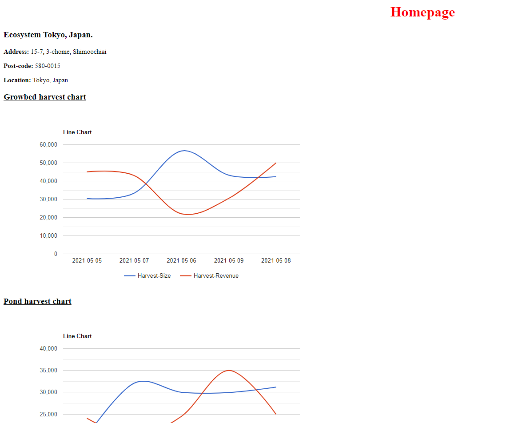

# ecosystem-tracker-app

To setup do the following: 1. Install node, npm and postgresql database. 2. Download git bash 3. Open /backend in git bash and run 'npm i' and after run 'npm run db:seed' then 'npm run dev'

